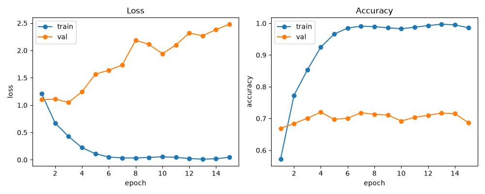
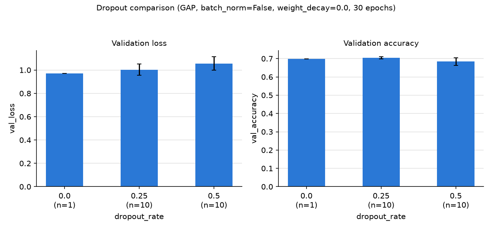
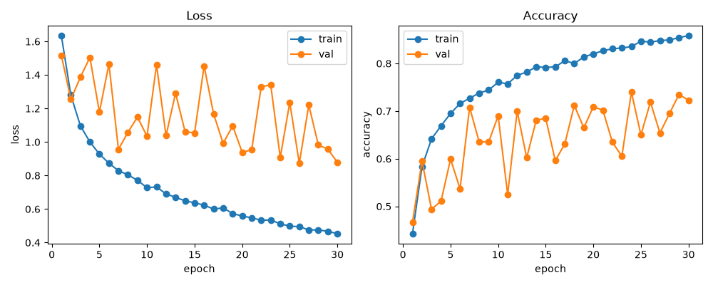
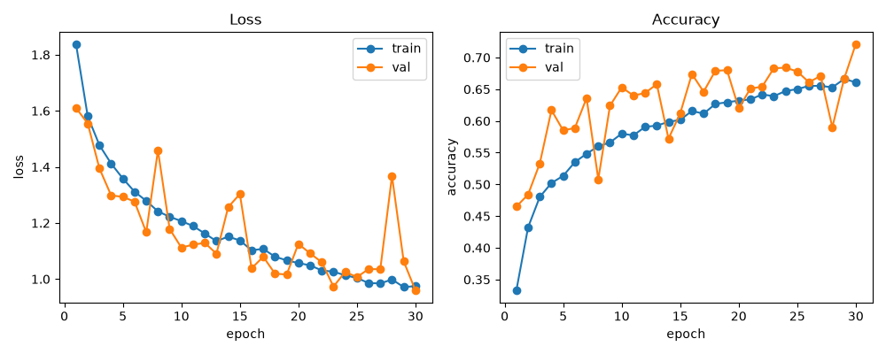
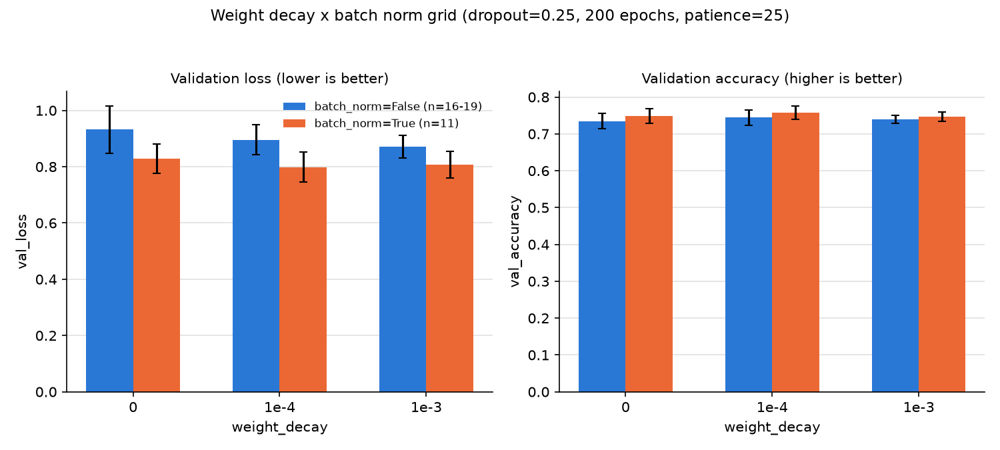
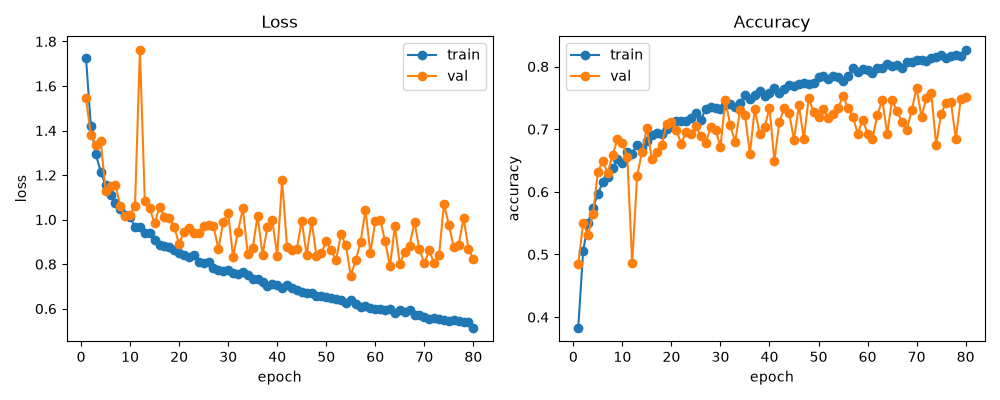

# Hyperparameter Tuning Summary

Final settings: **`dropout_rate=0.25`, `weight_decay=0.0001`, `batch_norm=True`,
GAP architecture.** Based on 138 training runs (see `experiments/`).

## What "best" means here

1. **Lowest val_loss** — primary signal, the actual training objective.
2. **val_accuracy** must agree directionally.
3. **Train/val gap** catches misleading results — twice in this process an
   option looked best on raw val_loss only because it overfit harder to get
   there, not because it generalized better.
4. **Consistency across reps** breaks remaining ties.

Testing time was limited, so not every comparison has enough reps for
statistical proof. Where that's true, we say so and pick the better
observed value rather than claim certainty the data doesn't support.

## What each setting does

- **GAP (global average pooling):** replaces flattening before the final
  dense layer. Flattening keeps every spatial position as a separate,
  easily-memorized feature; GAP averages each feature map to one number.
- **Dropout:** randomly zeroes activations during training so the network
  can't rely on any single feature too heavily.
- **Weight decay:** an L2 penalty that shrinks weight magnitudes.
- **Batch norm:** normalizes each layer's activations using the current
  batch's statistics, stabilizing and speeding up training.

## Why we tested this way

Settings were tuned one at a time (dropout, then weight decay, then batch
norm) rather than as a full grid, which would need far more runs than time
allowed. Comparisons matched epoch budget and every other setting except
the one being tested — mixing budgets was an early mistake here (see
Dropout) that inflated an earlier pass before being caught and fixed. Every
run is scored at its best epoch (lowest val_loss), not its last, since
early stopping ends runs at different epoch counts.

One-at-a-time tuning assumes settings don't interact. Weight decay and
batch norm are a documented exception — batch norm's scale invariance
changes what an L2 penalty does [[1]](#sources) — so we re-tested weight
decay with batch norm on, at real conditions (200 epochs, patience=25). We
also checked dropout under batch norm, since that pairing is separately
documented to interact [[2]](#sources) (dropout is the last layer here,
downstream of all batch norm, so that mechanism doesn't apply, but we
verified the ranking held anyway).

## Architecture: GAP, not flatten

Flatten drove train accuracy to ~99% while val accuracy stalled near 70%:

GAP fixed this by shrinking the final layer from 163,850 to 650 parameters.
Not revisited with formal statistics — the effect was too large to need it.

## Dropout: 0.25

| dropout_rate | n | val_loss | val_accuracy | loss gap |
|---|---|---|---|---|
| 0.0 | 1 | 0.9698 | 0.6980 | 0.2779 |
| **0.25** | 10 | 1.0029 ± 0.0489 | 0.7043 ± 0.0053 | 0.1827 |
| 0.5 | 10 | 1.0560 ± 0.0572 | 0.6836 ± 0.0216 | 0.0336 |

`0.5` regularizes too hard (t_loss=2.23, t_acc=-2.94 vs `0.25`, significant).
`0.0` looks competitive on val_loss alone but has the largest overfitting
gap of the three:

Ruled out despite the raw number. Re-checked with batch norm on (n=10
each): `0.25` still beats `0.5` (t_loss=2.84, t_acc=-2.63):

`0.25` wins on val_loss, val_accuracy, and gap, with or without batch norm.
Only the `0.0` comparison is thin (n=1).

## Batch norm: True

The strongest finding, confirmed at two epoch budgets and all three
weight-decay values:

| Condition | val_loss (bn=False) | val_loss (bn=True) | t_loss | t_acc |
|---|---|---|---|---|
| wd=0, 30 epochs | 1.0029 ± 0.0489 (n=10) | 0.9125 ± 0.0319 (n=10) | -4.90 | 3.41 |
| wd=0, 200 epochs | 0.9323 ± 0.0839 (n=19) | 0.8284 ± 0.0530 (n=11) | -4.15 | 1.79 |
| wd=1e-4, 200 epochs | 0.8955 ± 0.0536 (n=16) | 0.7985 ± 0.0536 (n=11) | -4.62 | 1.80 |
| wd=1e-3, 200 epochs | 0.8718 ± 0.0401 (n=16) | 0.8081 ± 0.0472 (n=11) | -3.66 | 1.72 |

Every loss comparison is significant. Batch norm's running statistics are
a noisier estimate at small batch sizes (32 here), producing jaggier
validation curves than usual [[3]](#sources) — checked directly and
confirmed the noise doesn't trend upward over time.

## Weight decay: 0.0001

The closest call (n=11 per value, not enough for significance between the
top two: t_loss=-0.45, t_acc=1.60).

| weight_decay | n | val_loss | val_accuracy | loss gap | acc gap |
|---|---|---|---|---|---|
| **0.0001** | 11 | **0.7985 ± 0.0536** | **0.7579 ± 0.0182** | **0.1790** | **0.0320** |
| 0.001 | 11 | 0.8081 ± 0.0472 | 0.7472 ± 0.0128 | 0.1820 | 0.0443 |
| 0.0 | 11 | 0.8284 ± 0.0530 | 0.7488 ± 0.0199 | 0.2017 | 0.0374 |

`0.0001` has the best val_loss, val_accuracy, and gap on both metrics.
`0.001` only wins on run-to-run consistency. Per the criteria above, that's
`0.0001` — not statistically proven, but the better observed choice on
every metric that outranks variance. Both settings significantly beat no
weight decay:

## Final settings

| Setting | Value |
|---|---|
| Architecture | GAP |
| `dropout_rate` | 0.25 |
| `weight_decay` | 0.0001 |
| `batch_norm` | True |

## Sources

1. van Laarhoven, T. "L2 Regularization versus Batch and Weight
   Normalization." https://arxiv.org/abs/1706.05350
2. Li, X. et al. "Understanding the Disharmony between Dropout and Batch
   Normalization by Variance Shift." CVPR 2019. https://arxiv.org/abs/1801.05134
3. ml4devs. "Mini-Batch Training: Batch Size, Epochs, and Convergence."
   https://www.ml4devs.com/what-is/mini-batch-training/
